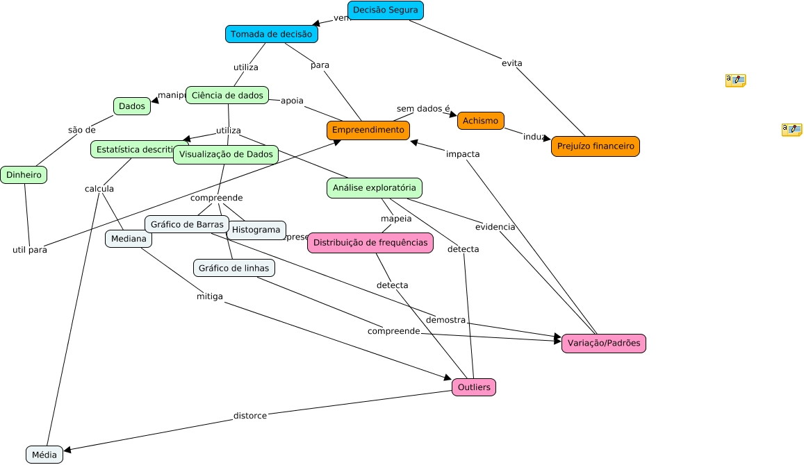

# Objeto de aprendizagem - Data Learning

O objeto de aprendizagem utiliza gamificação para guiar o **empreendedor** na transição da tomada de decisão baseada em "achismos" para decisões baseadas em dados.

Respondendo a pergunta central: "Como Tomar Melhores Decisões para seu Negócio e Ganhar Dinheiro?"

## Público-Alvo
Microempreendedores Individuais (MEIs) e pequenos empresários que possuem pouco ou nenhum conhecimento prévio em estatística ou ciência de dados. São pessoas focadas em manter seus negócios vivos e lucrativos, que precisam de ferramentas práticas para parar de depender apenas da intuição e passar a entender a realidade financeira de suas empresas.

---

## 🔗 Mapa Conceitual
**Acesse o mapa conceitual do projeto aqui:** <https://cmapscloud.ihmc.us/viewer/cmap/22QD6N2HB-JVQ337-18GN0W>



---

## Requisitos de Aprendizagem e Taxonomia de Bloom

O objeto de aprendizagem visa desenvolver as seguintes habilidades práticas no **empreendedor**:

### 1. Análise de Dados (O Fim do Achismo)
* **Descrição:** Capacidade de examinar conjuntos de dados simples e identificar padrões ou anomalias, respondendo a perguntas fechadas sobre o estado geral do negócio. Nível de complexidade: Simples.
* **Taxonomia de Bloom:** Compreender (Nível 2).
* **Justificativa:** Esta competência exige que o **usuário** entenda a estrutura dos dados e as relações básicas de vendas, sendo o primeiro passo para abandonar a intuição.

### 2. Visualização de Dados
* **Descrição:** Capacidade de selecionar o tipo de gráfico mais adequado (Evolução do tempo, Comparação de categorias ou Distribuição) para responder a uma dor específica do negócio, permitindo enxergar o que os números escondem. Nível de complexidade: Intermediário.
* **Taxonomia de Bloom:** Aplicar / Analisar (Níveis 3 e 4).
* **Justificativa:** A *Aplicação* ocorre ao selecionar o gráfico correto para a situação do negócio. A *Análise* é atingida quando o **empreendedor** interpreta a visualização para identificar, por exemplo, sazonalidade invisível ou a categoria de produtos mais lucrativa.

### 3. Interpretação Estatística
* **Descrição:** Competência para compreender o comportamento dos números e seus riscos práticos. Foco em diferenciar **Média** de **Mediana**, sabendo aplicá-las para proteger o caixa contra decisões enviesadas por "clientes atípicos" (outliers). Nível de complexidade: Avançado.
* **Taxonomia de Bloom:** Aplicar / Analisar (Níveis 3 e 4).
* **Justificativa:** A *Aplicação* se dá ao utilizar a estatística correta para o cenário apresentado. A *Análise* se manifesta ao reconhecer a limitação da Média, exigindo uma decomposição crítica dos dados para não cair na armadilha de valores extremos.

### 4. Tomada de Decisão Baseada em Dados (Evitando a Falência)
* **Descrição:** Capacidade de utilizar as informações extraídas Visualização e Estatística para tomar a decisão mais segura e rentável para a empresa, simulando um ambiente real de negócios sob pressão. Nível de complexidade: Avançado.
* **Taxonomia de Bloom:** Aplicar / Analisar (Níveis 3 e 4).
* **Justificativa:** Envolve a *Aplicação* das descobertas para desenvolver a solução para o negócio. A *Análise* final ocorre ao ponderar as evidências 

---

## Mapa Institucional


## ⏱️ Metodologia de Avaliação
A avaliação do progresso do usuário no objeto gamificado será medida através de dois critérios principais:
1. **Resultado Alcançado:** O índice de acerto nas escolhas das ferramentas (gráficos/estatística) e a precisão da decisão de negócios tomada no final de cada módulo.
2. **Tempo de Resposta:** O tempo que o usuário levou para identificar o problema e chegar na solução adequada, simulando a necessidade de agilidade na gestão real de uma pequena empresa.

---

## 🛠️ Instruções e Arquivos Necessários

O objeto de aprendizagem foi desenvolvido em **Python**, utilizando o framework **Streamlit** para a interface interativa.

### Arquivos necessários
- `app.py` — código-fonte principal do objeto de aprendizagem (telas, lógica dos 3 cenários e sistema de pontuação)
- `requirements.txt` — lista de dependências do projeto

### Pré-requisitos
- Python 3.9 ou superior instalado
- Gerenciador de pacotes `pip`

### Passo a passo para executar localmente

1. Clone o repositório:
```
git clone https://github.com/FerDelbo/objeto-de-aprendizagem-DataLearning
cd objeto-de-aprendizagem-DataLearning
```

2. (Opcional, recomendado) Crie um ambiente virtual:
```
python -m venv venv
source venv/bin/activate  # Linux/Mac
venv\Scripts\activate     # Windows
```

3. Instale as dependências:
```
pip install -r requirements.txt
```

Se o arquivo `requirements.txt` ainda não existir no repositório, crie-o com o seguinte conteúdo mínimo:
```
streamlit
```

4. Execute a aplicação:
```
streamlit run app.py
```

5. O Streamlit abrirá automaticamente uma aba no navegador padrão, geralmente em `http://localhost:8501`.

---


## 🌐 Acesso via Web

Este objeto de aprendizagem está publicado como aplicação web acessível pelo link [https://datalearningo.streamlit.app/].
